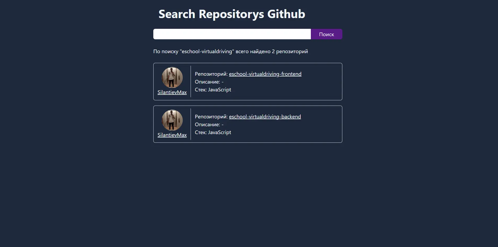

### Реализован поиск репозиторий на github

_В качестве UI использовал TailwindCss через CDN_ 

#### Функционал

- Поиск по подстроке
- Обработка пустого поле (ошибка)
- Вывод репозиторий + их владельцы
- Если ничего не найдено, выводит (Ничего не найдено)
- ...

